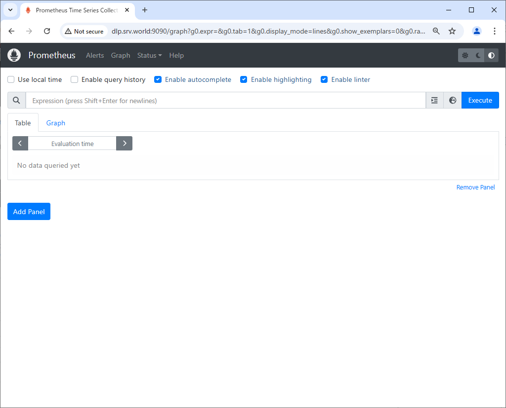
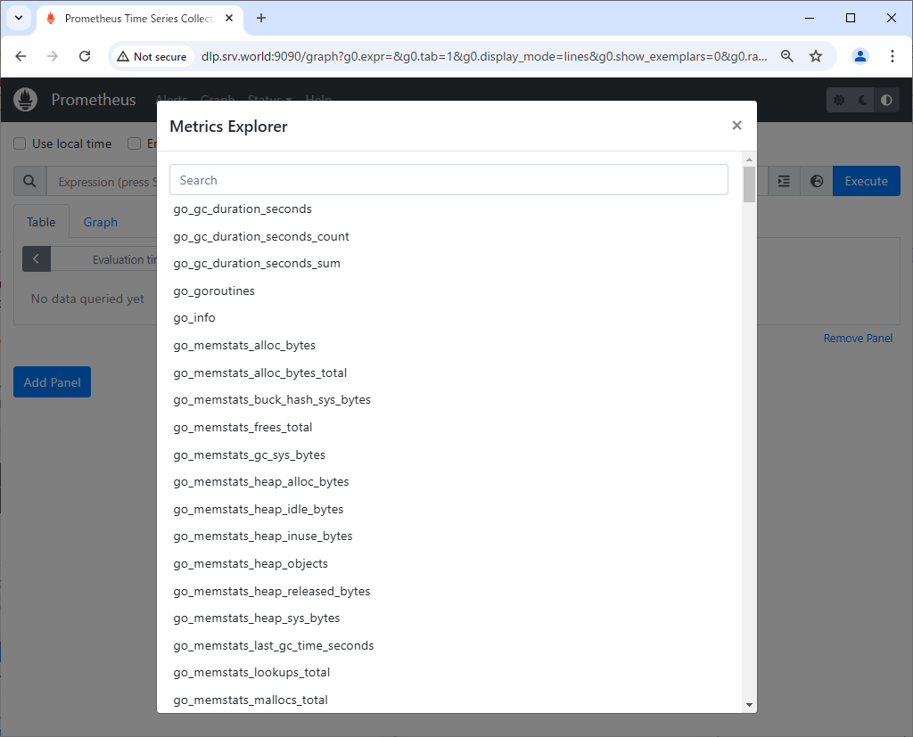
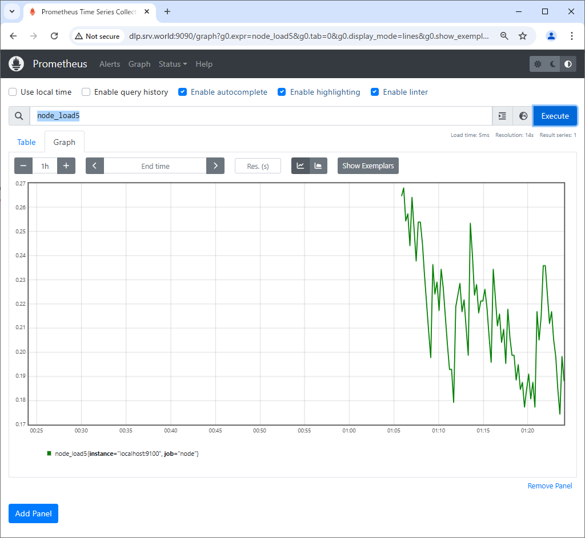

Prometheus : Install2024/09/06
 	
Install Systems monitoring and Alerting toolkit [Prometheus]. Learn Overview about Prometheus on the official site below. ⇒ https://prometheus.io/docs/introduction/overview/

[1]	Install Prometheus Server and also Install [node-exporter] that includes features to get metric data of general resource on the System like CPU or Memory usage.
```sh
root@belajarfreebsd:~# pkg install -y prometheus node_exporter
```
[2]	Configure basic settings on [prometheus.yml].
```sh
root@belajarfreebsd:~# vi /usr/local/etc/prometheus.yml
# my global config
global:
  scrape_interval: 15s # Set the scrape interval to every 15 seconds. Default is every 1 minute.
  evaluation_interval: 15s # Evaluate rules every 15 seconds. The default is every 1 minute.
  # scrape_timeout is set to the global default (10s).

# Alertmanager configuration
alerting:
  alertmanagers:
    - static_configs:
        - targets:
          # - alertmanager:9093

# Load rules once and periodically evaluate them according to the global 'evaluation_interval'.
rule_files:
  # - "first_rules.yml"
  # - "second_rules.yml"

# A scrape configuration containing exactly one endpoint to scrape:
# Here it's Prometheus itself.
scrape_configs:
  # The job name is added as a label `job=<job_name>` to any timeseries scraped from this config.
  - job_name: "prometheus"

    # metrics_path defaults to '/metrics'
    # scheme defaults to 'http'.

    static_configs:
      - targets: ["localhost:9090"]

  # add follows to monitor localhost
  - job_name: node
    static_configs:
      - targets: ['localhost:9100']

root@belajarfreebsd:~# service prometheus enable
root@belajarfreebsd:~# service prometheus start
root@belajarfreebsd:~# service node_exporter enable
root@belajarfreebsd:~# service node_exporter start
```
[3]	Access to the [http://(Prometheus server's hostname or IP address):9090/] from a client host, Then, Prometheus Web UI is shown like follows.

[4]	To click the icon to the left of the [Execute] button, it will display a list of various queries that can be used to reference the saved time series data.
It's also possible to input queries directly on the input form above, by Prometheus [Expression Language].
Refer to the official document about usage of Expression Language.
⇒ https://prometheus.io/docs/querying/examples/

[5]	This is the state of executing [node_load5].
