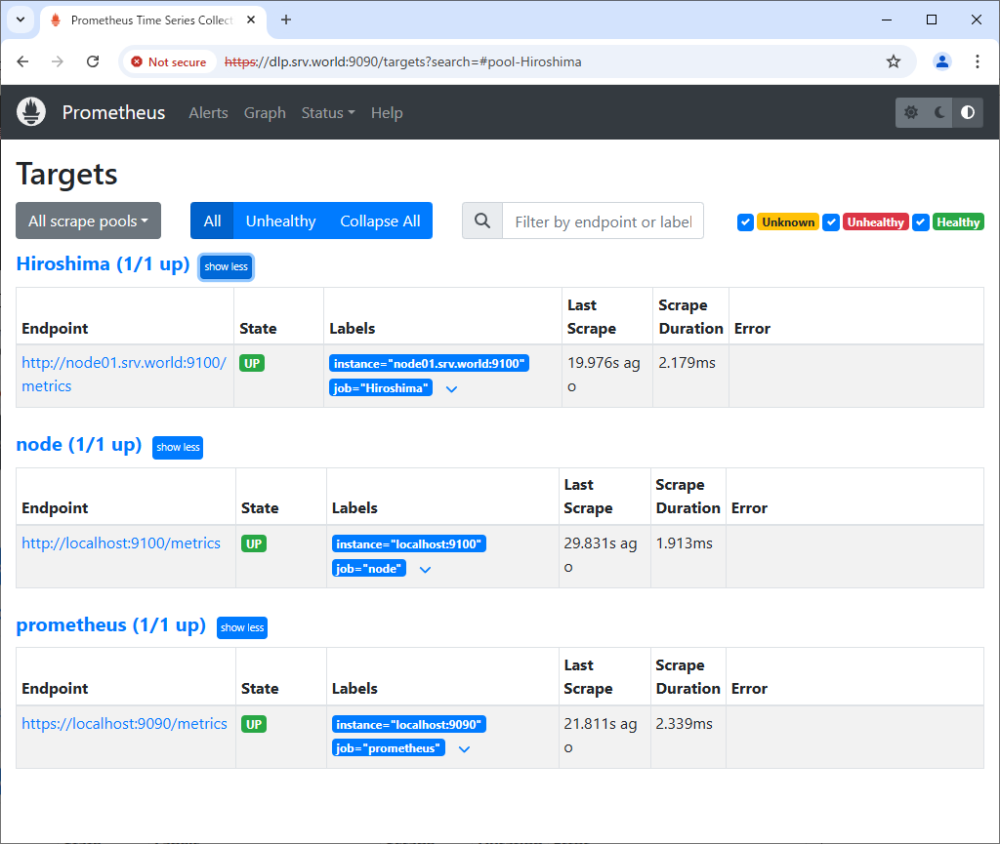
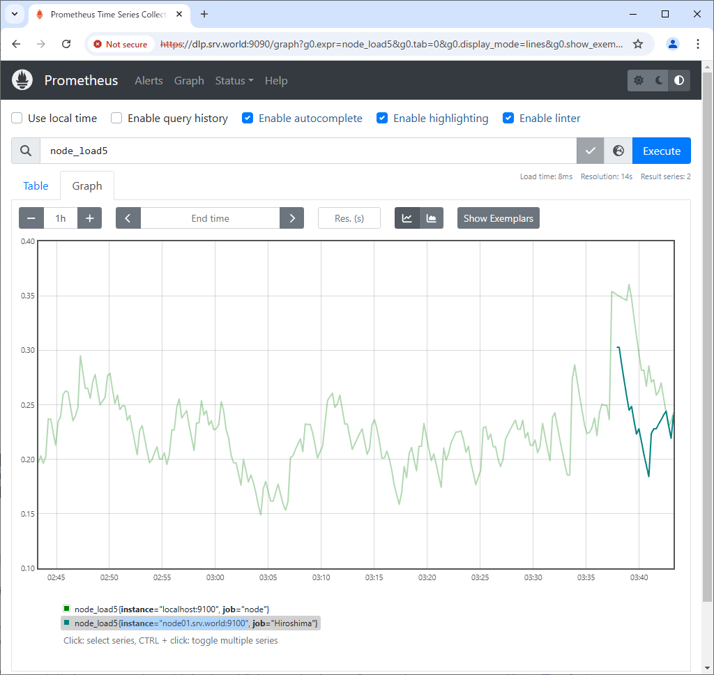
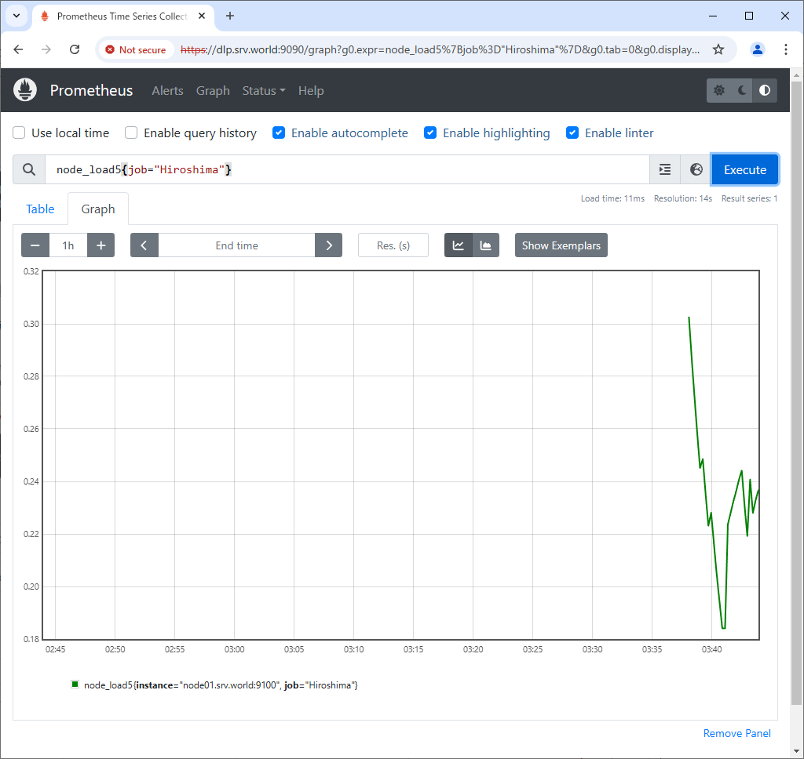
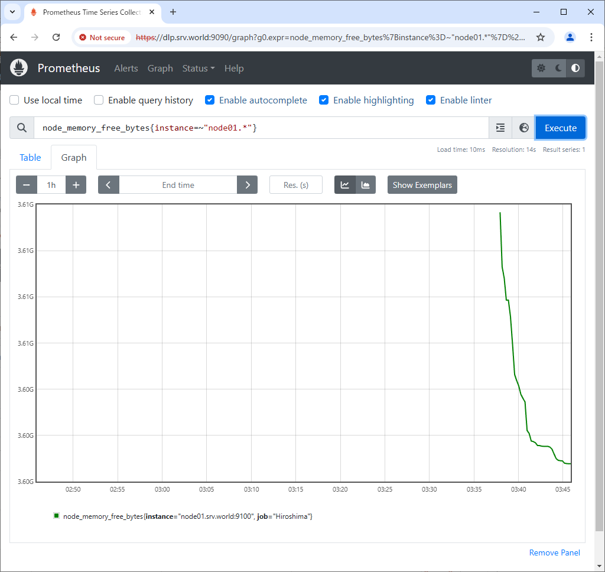

Prometheus : Add Monitoring Target
 	
Add Monitoring Target Nodes.

[1]	Install [node-exporter] package on the Node you'd like to add that includes features to get metric data of general resource on the System like CPU or Memory usage.
```sh
root@node01:~# pkg install -y node_exporter
root@node01:~# service node_exporter enable
root@node01:~# service node_exporter start
```
[2]	Add setting on Prometheus Server Configuration.
```sh
root@belajarfreebsd:~# vi /usr/local/etc/prometheus.yml
.....
.....
scrape_configs:
  # The job name is added as a label `job=<job_name>` to any timeseries scraped from this config.
  - job_name: "prometheus"

    # metrics_path defaults to '/metrics'
    # scheme defaults to 'http'.
    scheme: https
    tls_config:
      cert_file: /usr/local/etc/server.crt
      key_file: /usr/local/etc/server.key
      insecure_skip_verify: true
    basic_auth:
      username: 'admin'
      password: 'password'

    static_configs:
      - targets: ["localhost:9090"]

  - job_name: node
    # add new Host to [targets] line
    static_configs:
      - targets: ['localhost:9100', 'node01.belajarfreebsd.or.id:9100']

  # alternatively, if you'd like to add to another group,
  # add [job_name] section like follows
  # any name is OK for [job_name]
  - job_name: Hiroshima
    static_configs:
      - targets: ['node01.belajarfreebsd.or.id:9100']

root@belajarfreebsd:~# service prometheus restart
```
[3]	Access to the Prometheus Web UI and click [Status] - [Targets] to verify new nodes are listed.
<br>

[4]	To input query directly, it's possible to display specific Job or Node.
The example below shows a Job for [node_load5]. ⇒ node_load5{job="Hiroshima"}

[5]	The example below shows a Node for [node_memory_free_bytes]. ⇒ node_memory_free_bytes{instance=~"node01.*"}
