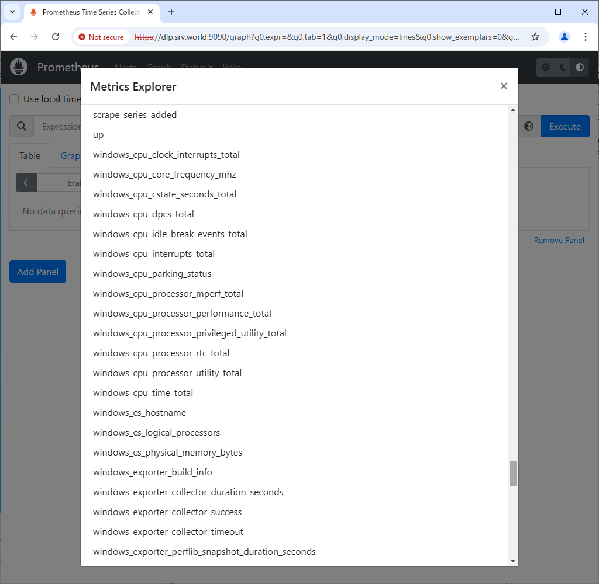

Prometheus : Add Monitoring Target (Windows)2024/09/06
 	
If you want to add a Windows computer as a monitored node, configure it as follows.

[1]	Install Windows exporter on the target Windows computer.
Download the MSI installer from the following site and install it.

⇒ https://github.com/prometheus-community/windows_exporter/releases

[2]	After installed, [windows_exporter] will start and listen on port [9182].
An incoming rule will also be registered in Windows Firewall. (if not registred, allow 9182 manually)
<br>

[3]	Add setting on Prometheus Server Configuration.
```sh
root@belajarfreebsd:~# vi /usr/local/etc/prometheus.yml
.....
.....
scrape_configs:
  # The job name is added as a label `job=<job_name>` to any timeseries scraped from this config.
  - job_name: "prometheus"

    # metrics_path defaults to '/metrics'
    # scheme defaults to 'http'.
    scheme: https
    tls_config:
      cert_file: /usr/local/etc/server.crt
      key_file: /usr/local/etc/server.key
      insecure_skip_verify: true
    basic_auth:
      username: 'admin'
      password: 'password'

    static_configs:
      - targets: ["localhost:9090"]

  - job_name: node
    # add new Windows Host to [targets] line
    static_configs:
      - targets: ['localhost:9100', 'rx-7.belajarfreebsd.or.id:9182']

  # alternatively, if you'd like to add to another group,
  # add [job_name] section like follows
  # any name is OK for [job_name]
  - job_name: Windows
    static_configs:
      - targets: ['rx-7.belajarfreebsd.or.id:9182']

root@belajarfreebsd:~# service prometheus restart
```
[4]	Access to the Prometheus Web UI and click [Status] - [Targets] to verify new nodes are listed.
<br>
<br>
