Prometheus : Visualize on Grafana

Web UI is included in Prometheus but it's also possible to visualize time series data on Grafana.

[1]	Install Grafana, refer to here.
It's OK to install it on any Node. (install it on Prometheus server Node on this example)

[2]	Access to Grafana Dashboard and Open [Connections] - [Data Sources] on the left menu.
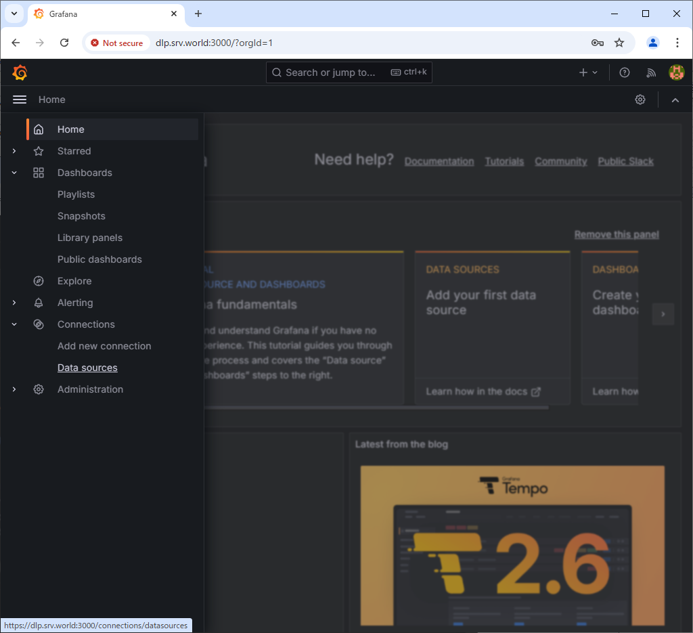
[3]	Click [Add data source].
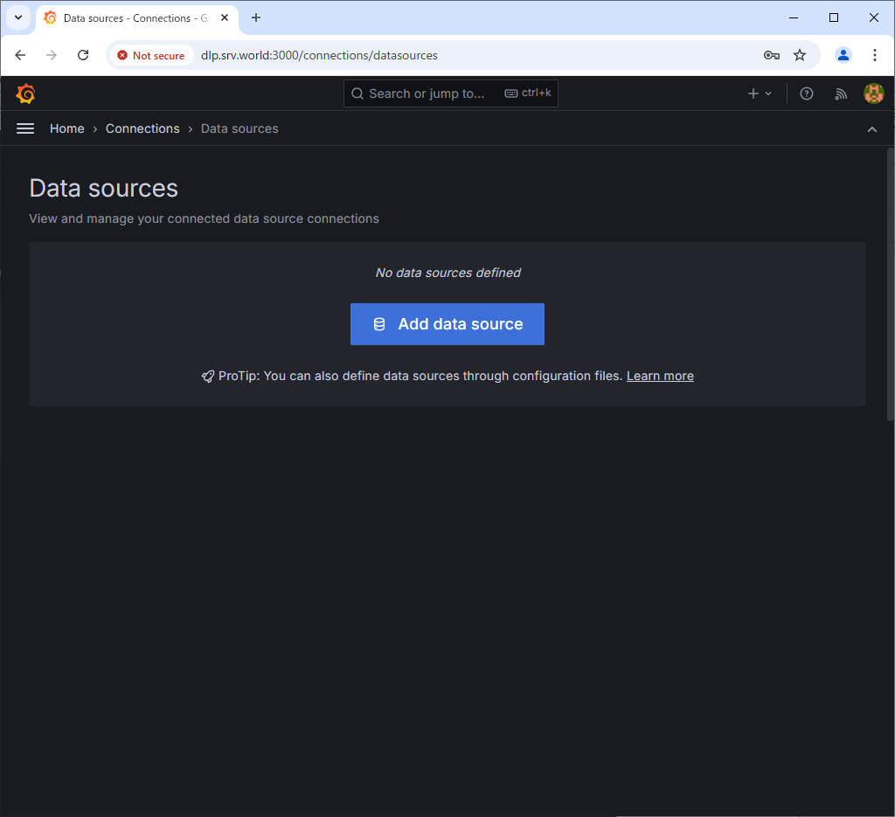
[4]	Click [Prometheus].
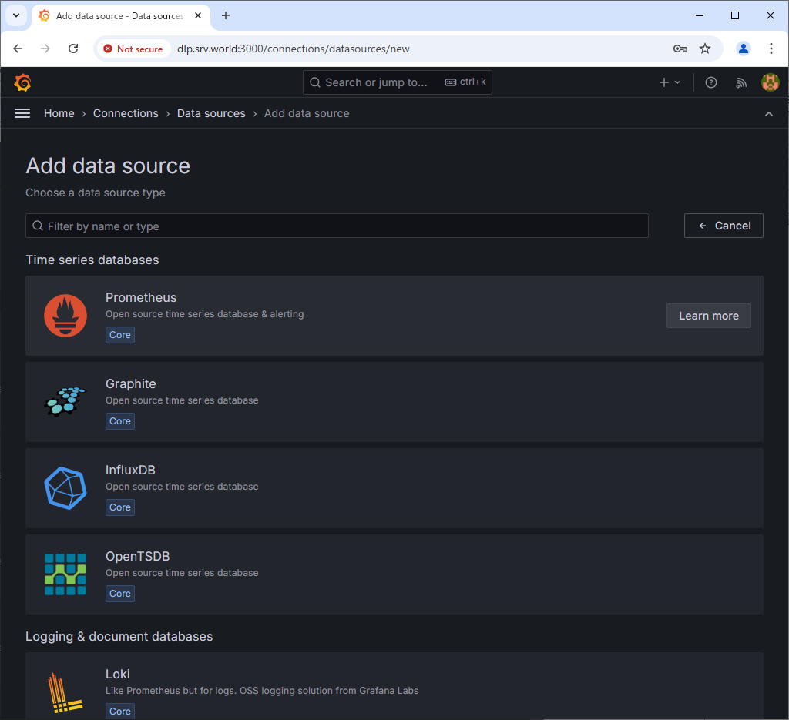
[5]	Enter the endpoint URL of your Prometheus server in the URL field and click the Save & Test button at the bottom of the screen.
If you have enabled authentication or HTTPS, configure the necessary settings accordingly.
If there are no problems, you will see the message [Successfully queried the prometheus API].
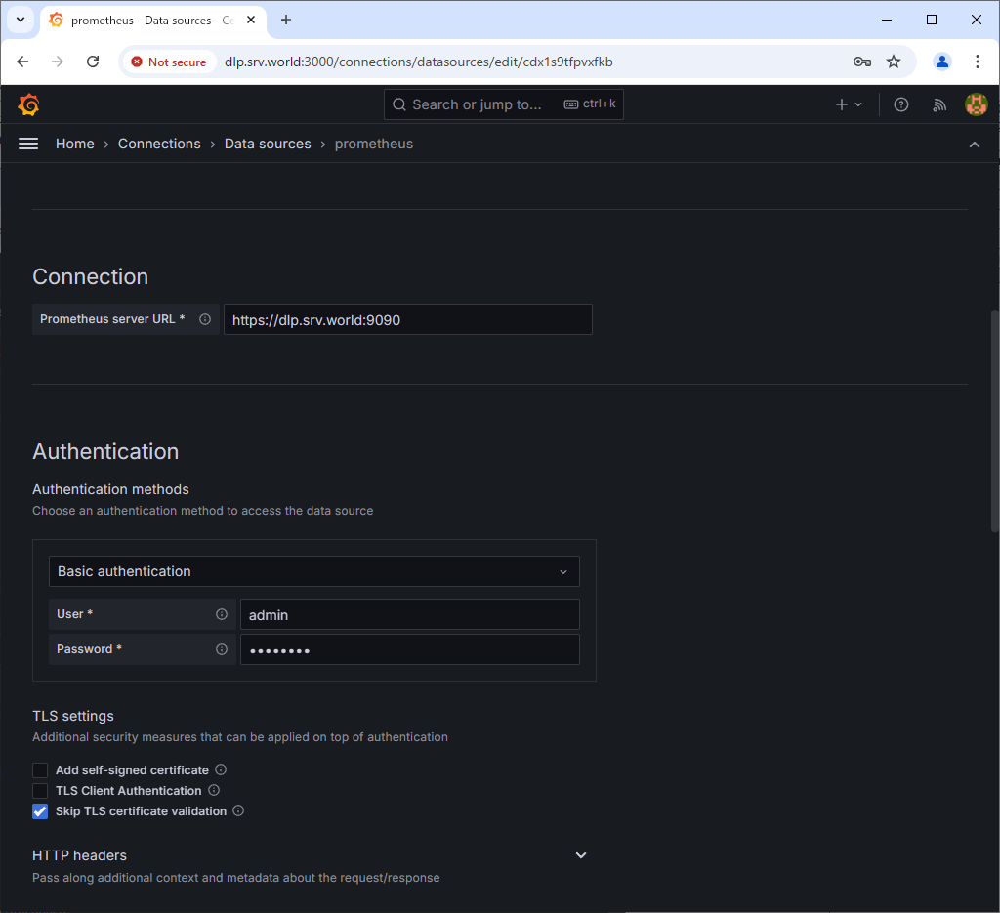
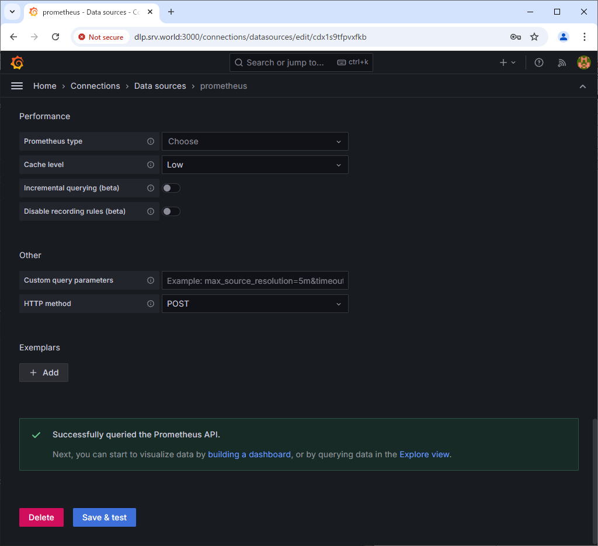
[6]	Next, Click [Dashboard] on the left menu.
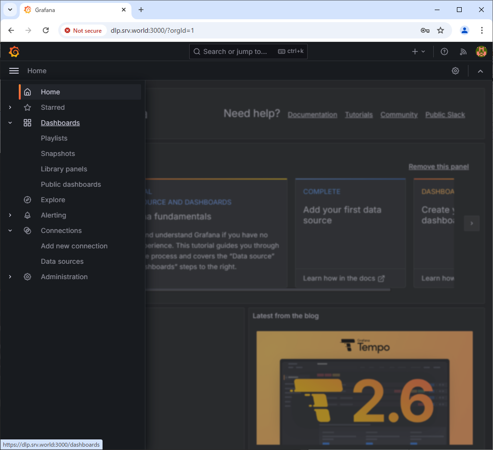
[7]	Click [Create Dashboard].
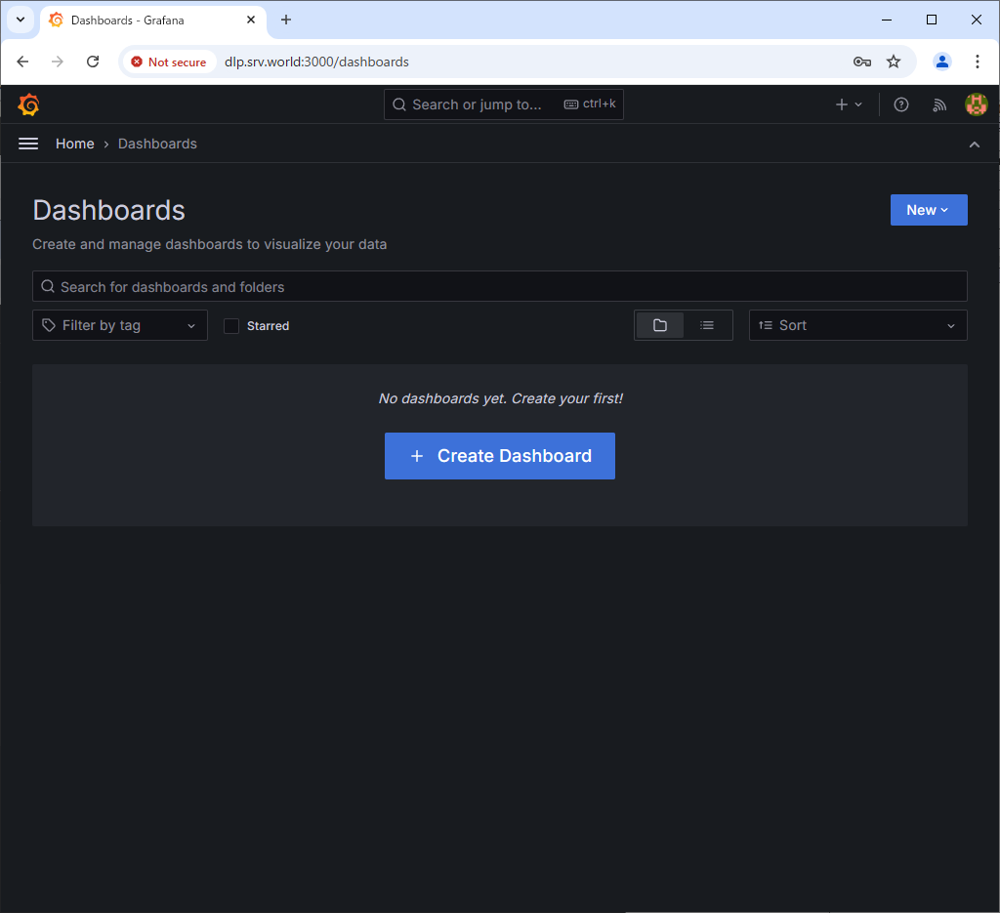
[8]	Click [Add visualization].
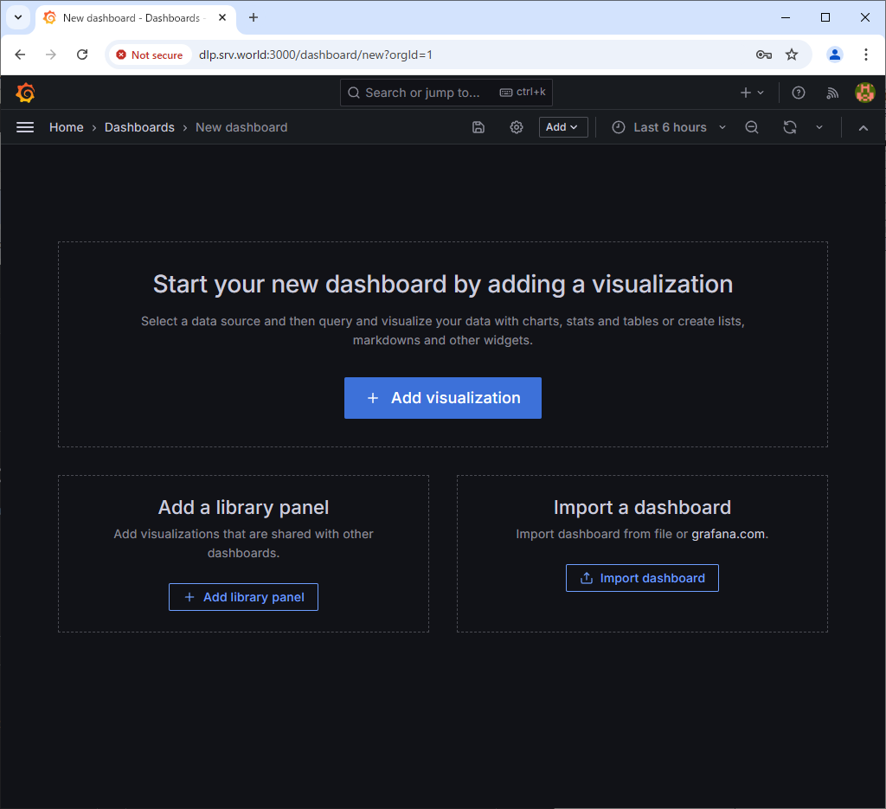
[9]	Click [Prometheus].
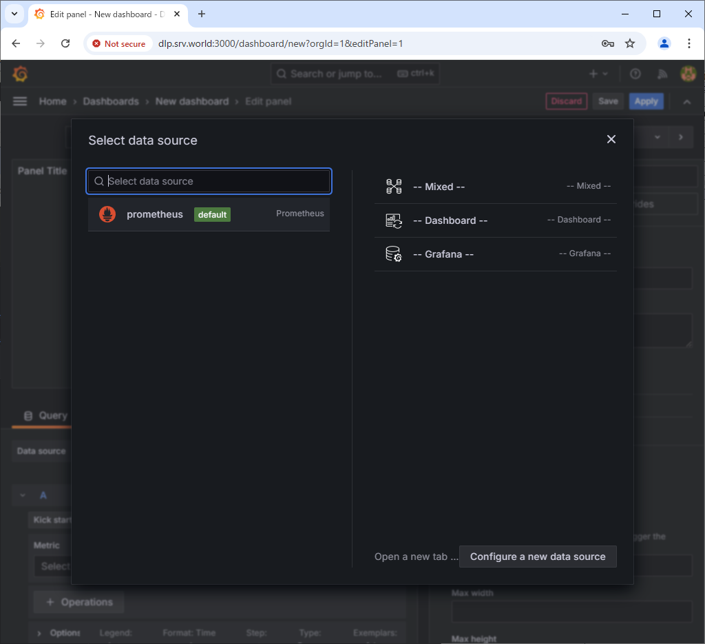
[10] From the Metrics field, select the query for the data you want to graph.
Once you select a query, it will be graphed. To save the Dashboard, click the Save button at the top.
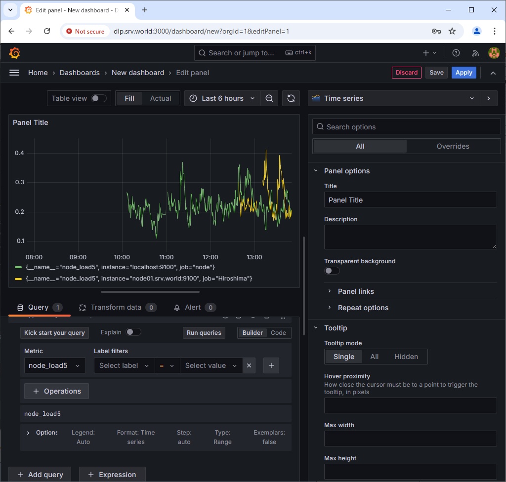
[11] By adding queries, it is also possible to display multiple graphs on one screen.
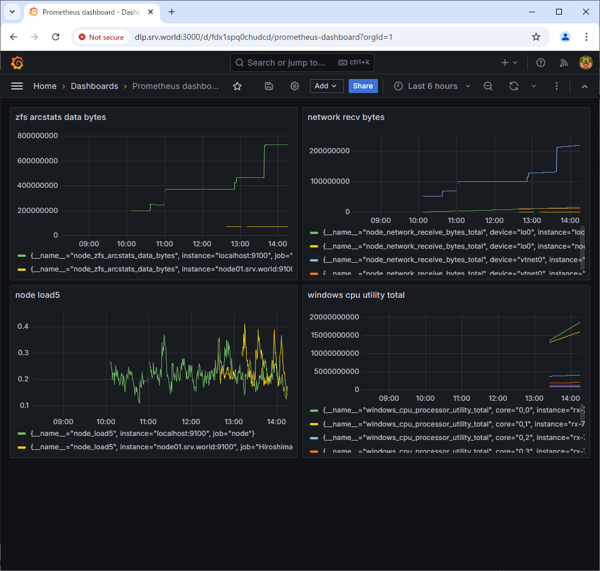