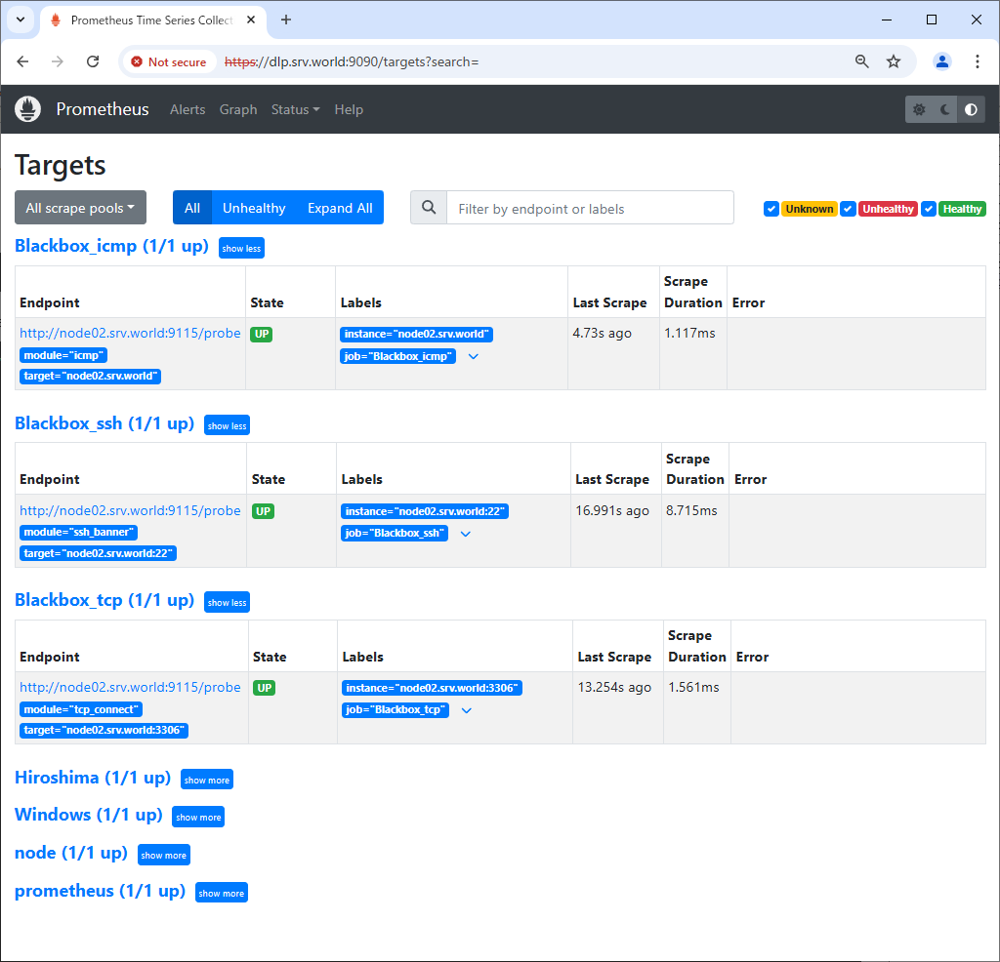
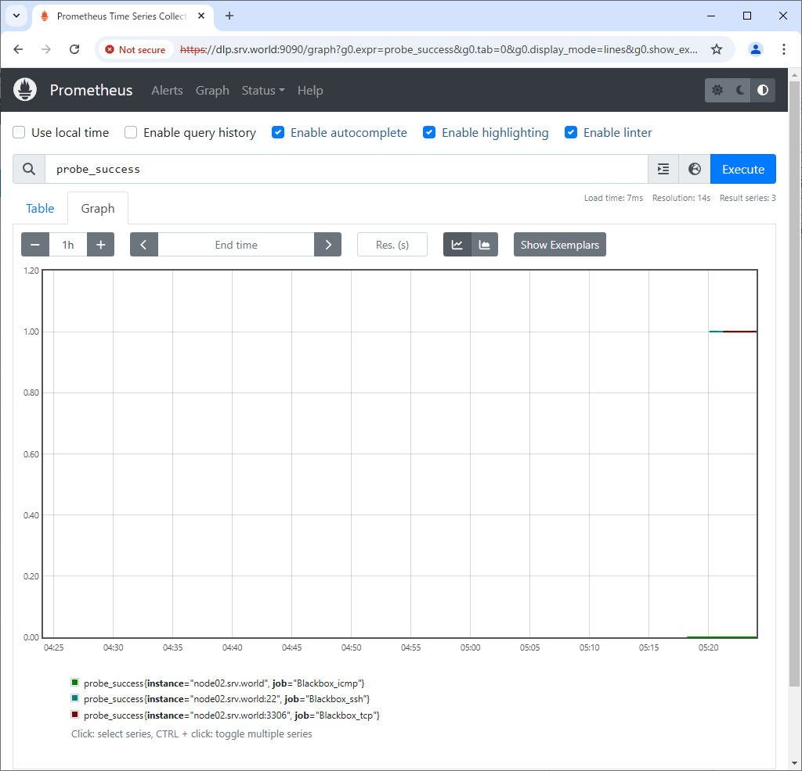

Prometheus : Blackbox exporter
 	
To configure Blackbox exporter, it's possible to probe endpoints over HTTP, HTTPS, DNS, TCP and ICMP.

[1]	On a Node you'd like to monitor with Blackbox exporter, Install it.
```sh
root@node02:~# pkg install -y blackbox_exporter
```
[2]	This is the setting file of Blackbox exporter. (Keep default on this example)
```sh
root@node02:~# cp /usr/local/share/examples/blackbox_exporter/blackbox.yml /usr/local/etc/blackbox_exporter.yml
root@node02:~# cat /usr/local/etc/blackbox_exporter.yml
modules:
  http_2xx:
    prober: http
    http:
      preferred_ip_protocol: "ip4"
  http_post_2xx:
    prober: http
    http:
      method: POST
  tcp_connect:
    prober: tcp
  pop3s_banner:
    prober: tcp
    tcp:
      query_response:
      - expect: "^+OK"
      tls: true
      tls_config:
        insecure_skip_verify: false
  grpc:
    prober: grpc
    grpc:
      tls: true
      preferred_ip_protocol: "ip4"
  grpc_plain:
    prober: grpc
    grpc:
      tls: false
      service: "service1"
  ssh_banner:
    prober: tcp
    tcp:
      query_response:
      - expect: "^SSH-2.0-"
      - send: "SSH-2.0-blackbox-ssh-check"
  irc_banner:
    prober: tcp
    tcp:
      query_response:
      - send: "NICK prober"
      - send: "USER prober prober prober :prober"
      - expect: "PING :([^ ]+)"
        send: "PONG ${1}"
      - expect: "^:[^ ]+ 001"
  icmp:
    prober: icmp
  icmp_ttl5:
    prober: icmp
    timeout: 5s
    icmp:
      ttl: 5

root@node02:~# sysrc "blackbox_exporter_listen_address=0.0.0.0:9115"
blackbox_exporter_listen_address: -> 0.0.0.0:9115
root@node02:~# service blackbox_exporter enable
blackbox_exporter enabled in /etc/rc.conf
root@node02:~# service blackbox_exporter start
Starting blackbox_exporter.
```
[3]	Add settings on Prometheus Server Node.
```sh
root@belajarfreebsd:~# vi /usr/local/etc/prometheus.yml
.....
.....
scrape_configs:
  # The job name is added as a label `job=<job_name>` to any timeseries scraped from this config.
  - job_name: 'prometheus'

.....
.....

  # the case to use [icmp] module
  # any [job_name]
  - job_name: 'Blackbox_icmp'
    metrics_path: /probe
    params:
      module: [icmp]
    static_configs:
      - targets:
        # hostname or IP address of target Host
        - node02.belajarfreebsd.or.id
    relabel_configs:
      - source_labels: [__address__]
        target_label: __param_target
      - source_labels: [__param_target]
        target_label: instance
      - target_label: __address__
        # Blackbox exporter Host:Port
        replacement: node02.belajarfreebsd.or.id:9115

  # the case to use [ssh_banner] module
  - job_name: 'Blackbox_ssh'
    metrics_path: /probe
    params:
      module: [ssh_banner]
    static_configs:
      - targets:
        # target Host:Port
        - node02.belajarfreebsd.or.id:22
    relabel_configs:
      - source_labels: [__address__]
        target_label: __param_target
      - source_labels: [__param_target]
        target_label: instance
      - target_label: __address__
        replacement: node02.belajarfreebsd.or.id:9115

  # the case to use [tcp_connect] module
  - job_name: 'Blackbox_tcp'
    metrics_path: /probe
    params:
      module: [tcp_connect]
    static_configs:
      - targets:
        # target Host:Port (example below is MariaDB/MySQL)
        - node02.belajarfreebsd.or.id:3306
    relabel_configs:
      - source_labels: [__address__]
        target_label: __param_target
      - source_labels: [__param_target]
        target_label: instance
      - target_label: __address__
        replacement: node02.belajarfreebsd.or.id:9115 

root@belajarfreebsd:~# service prometheus restart
```
[4]	Access to the Prometheus Web UI and move to [Status] - [Targets], then new configured targets are shown.
It's possible to see data on [probe_success] metric.

