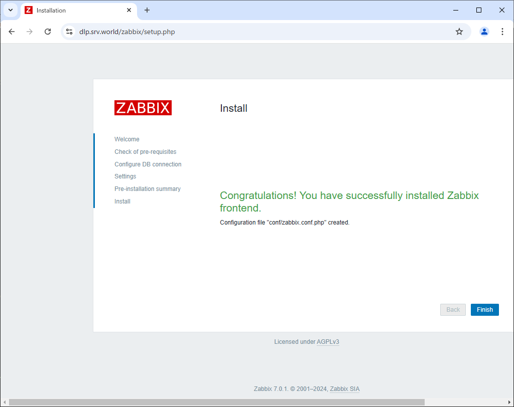
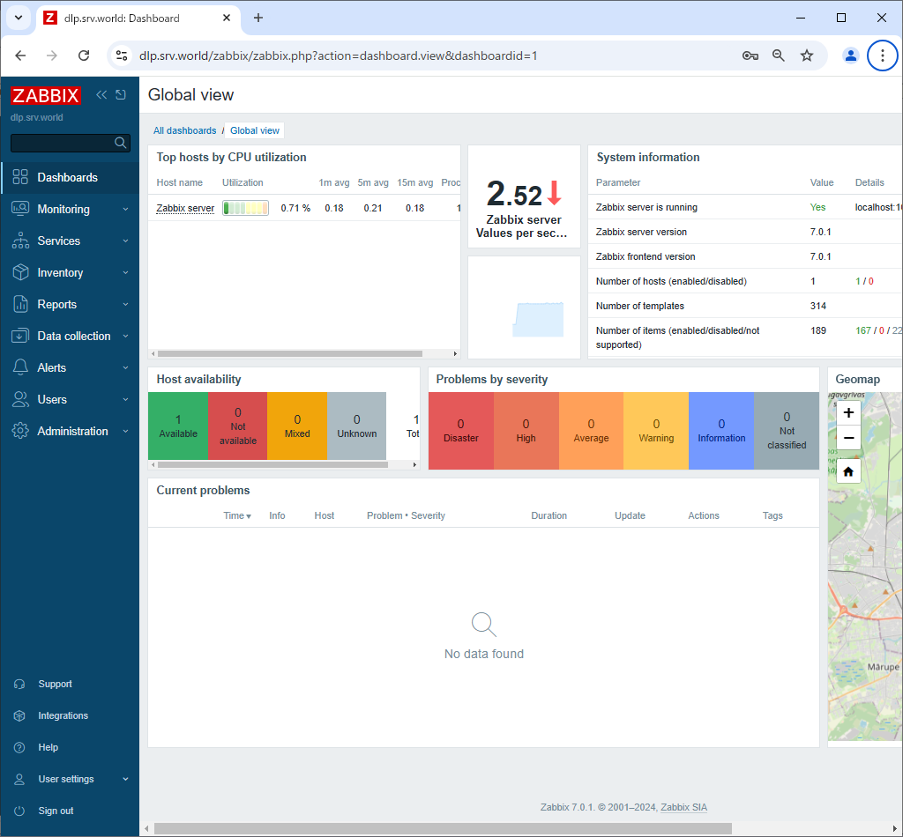

Zabbix 7.0 : Initial Setup
 	
This is the Initial Setup for Zabbix server.

[1]	Access to the [https://(Zabbix server's hostname or IP address)/zabbix/] from a client computer which is in the network allowed by Zabbix server. Then, Zabbix start page is displayed, Click [Next step] to proceed.

[2]	Make sure all items are [OK], then proceed to next to click [Next step].

[3]	This is the database settings section. Set Zabbix User and Database, DB Password.

[4]	This is the connection settings to Zabbix server. If it's local one, it's OK with keeping default. But It had better to change [Name] field to any name you like.

[5]	This is the confirmation of previous settings, proceed to next if all is OK.

[6]	Click [Finish] to complete initial setup.

[7]	This is the login page. It's possible to login with the username [Admin], initial password [zabbix].

[8]	Just logined. This is the index of Zabbix administration site.
