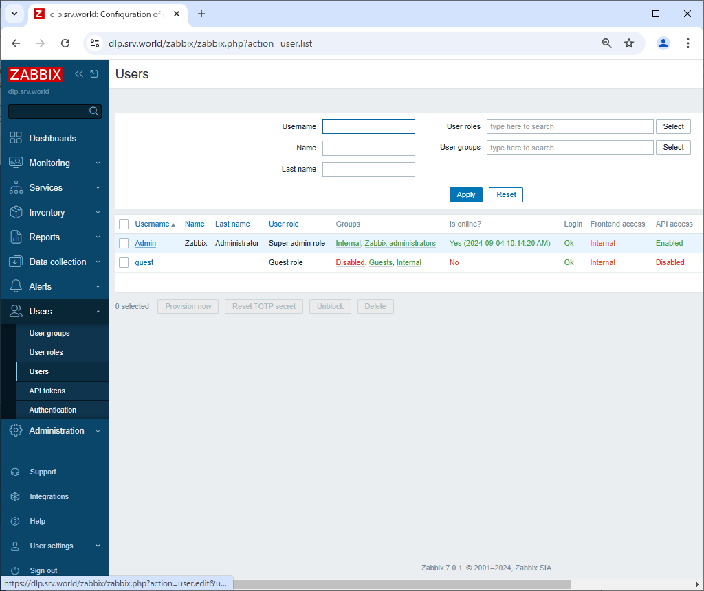
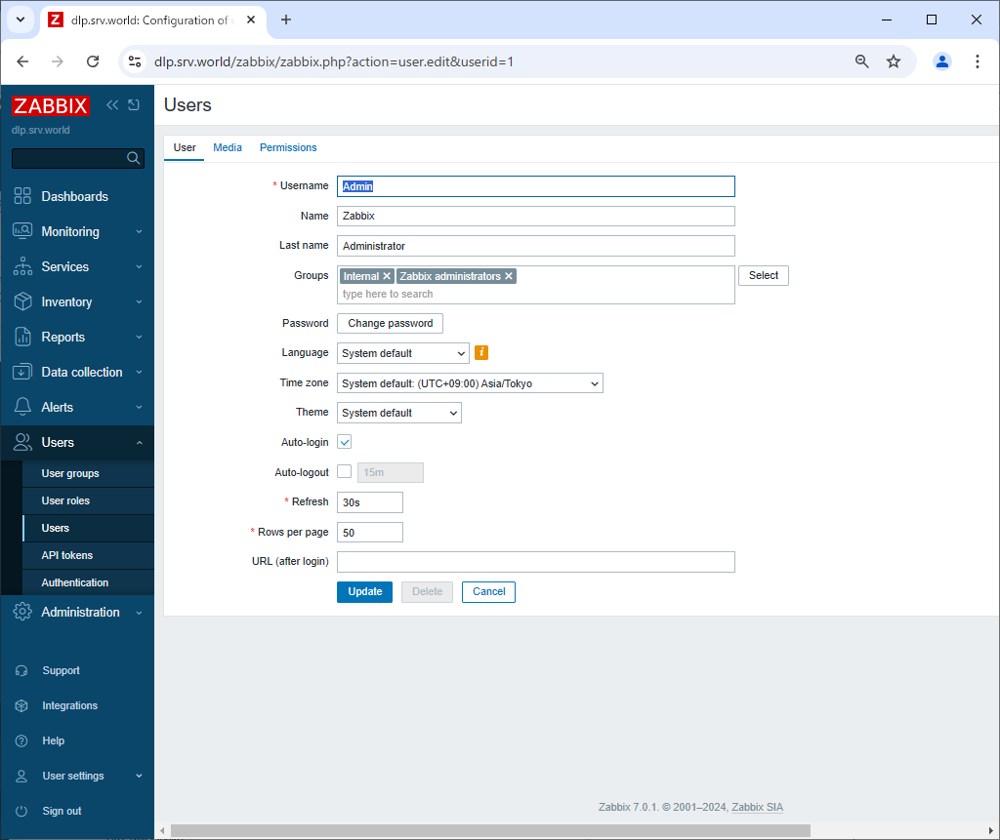
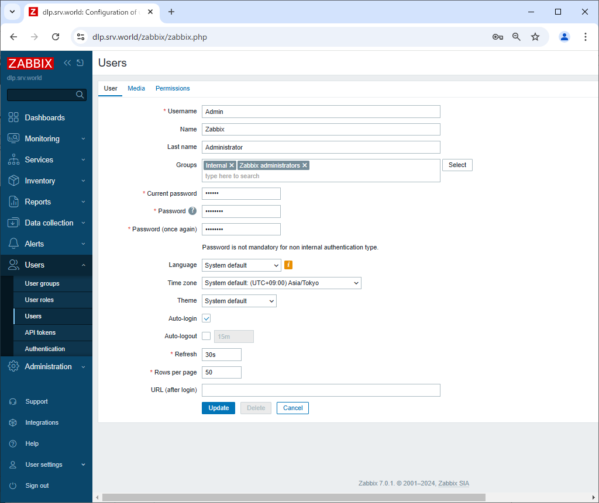

Zabbix 7.0 : Change admin password
 	
Change admin password first. And also set admin email address for notifications.

[1]	Login to Zabbix admin site with [Admin] user and select [Users] - [Users] on the left pane, then click [Admin] link on the right pane.

[2]	Click the [Change password] button.

[3]	Input password you'd like to change and click [Update] to change password.
By the way, this example is English displayed but if you'd like to change display language, it's possible to select it on [Language] field.
