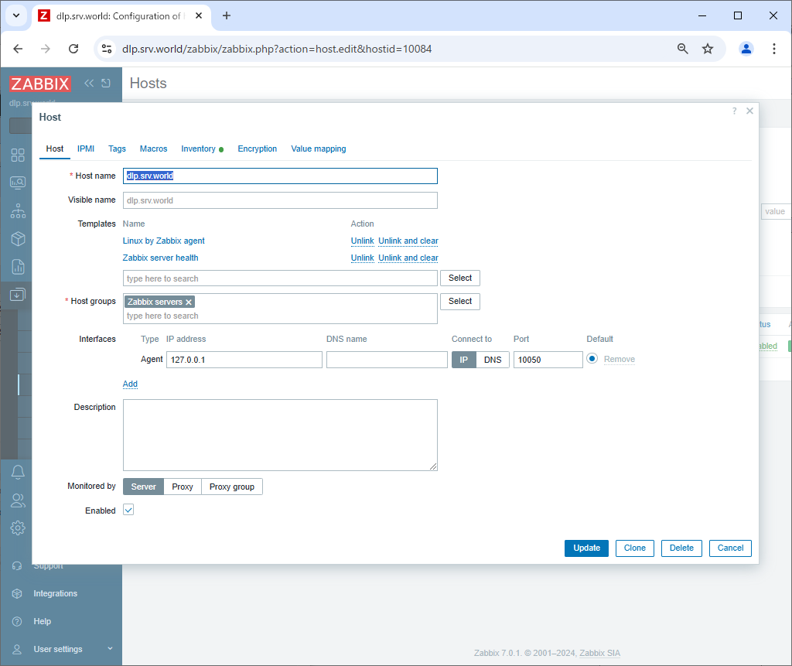

Zabbix 7.0 : Set Monitoring Target Host
 	
Configure Monitoring Target Host.

[1]	Login to Zabbix admin site with [Admin] user and select [Data collection] - [Hosts] on the left pane.
Monitoring of Zabbix server that Zabbix Agent has been installed is enabled by default, but it needs to change some settings.
Click the hostname [Zabbix server].

[2]	The name of Zabbix server itself is registered as the name [Zabbix server], however, it needs to set the same name with the one you set [Hostname=***] parameter in [zabbix_agent.conf].
So change the name in [Host name] field to the name you set.

[3]	Change template, too.
By default, [Linux by Zabbix agent] is applied, but since the OS is different, change it.
First, click the [Unlink and clear] link to the right of [Linux by Zabbix agent].

[4]	Click the [Select] button in the Templates field.

[5]	Click the [Select] button.

[6]	Click the [Templates/Operating systems] link.

[7]	Click the [FreeBSD by Zabbix agent] link.

[8]	Click the [Update] button to apply changes.

[9]	After a while, various data will be collected and you will be able to check the server status as shown below.
 
