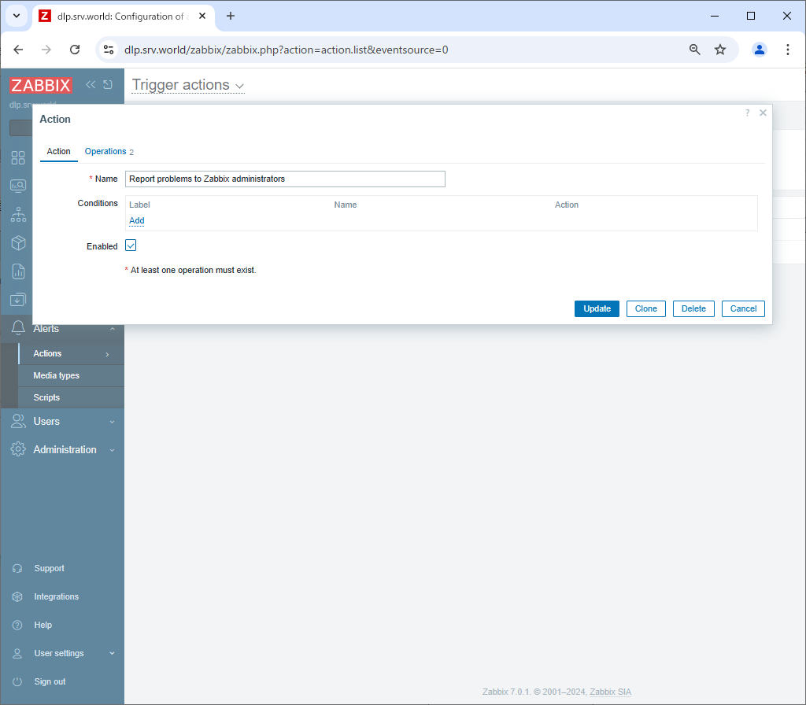

Zabbix 7.0 : Set Notification
 	
Set up notifications so that you can receive information about problems, etc.
Various media can be used, but in this example we will set it to send email notifications.

So This is based on that SMTP server is running on your local network.
On this example, Configure settings to use SMTP Server on localhost.

[1]	Login to Zabbix admin site with [Admin] user and select [Alerts] - [Media Types] on the left pane, then click [Email] link on the right pane.

[2]	Configure the mail server settings as shown below, check [Enabled] at the bottom, and click the [Update] button.

[3]	If [Email] is set to [Enabled], that's OK.

[4]	Next, select [Users] - [Users] in the left pane, and click [Admin] in the right pane.

[5]	Go to the [Media] tab and click the [Add] link.

[6]	Select [Email] in the Type field, enter the administrator email address in [Send to], and click the [Add] button.

[7]	Click the [Update] button to complete the registration.

[8]	Next, select [Alerts] - [Actions] - [Trigger actions] in the left pane, and click [Report problems to Zabbix administrators] in the right pane.

[9]	Check [Enabled] and click the [Update] button.
With this, various error notifications will be sent to the specified email address for the monitoring items for which thresholds have been set.
