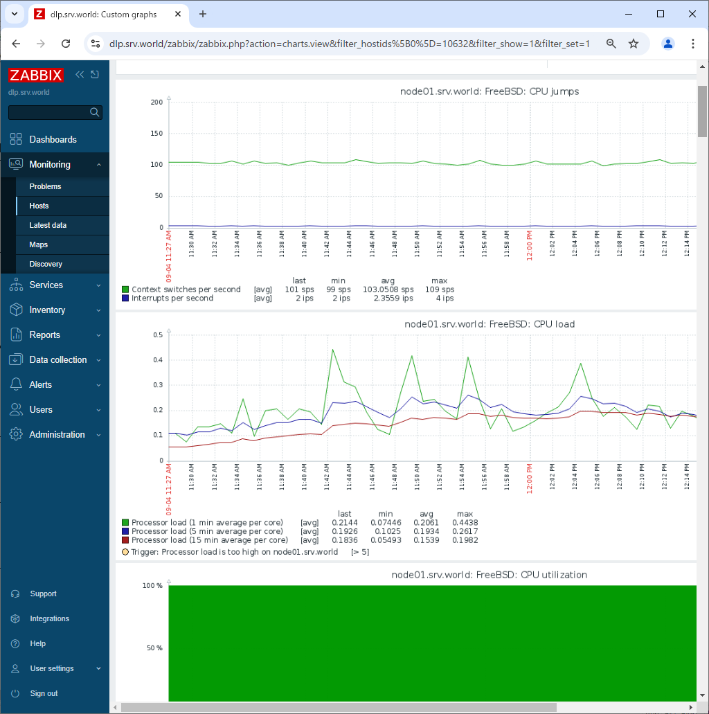

Zabbix 7.0 : Add Monitoring Target (FreeBSD)
 	
Add Monitoring Target Host. Add a FreeBSD 14 server as an example on here.

[1]	Install Zabbix Agent on the server you'd like to add for monitoring target.
```sh
root@node01:~# pkg install -y zabbix7-agent
root@node01:~# vi /usr/local/etc/zabbix7/zabbix_agentd.conf
# line 113 : specify Zabbix server
Server=10.0.0.30
# line 167 : specify Zabbix server
ServerActive=10.0.0.30
# line 178 : change to your hostname
Hostname=node01
root@node01:~# service zabbix_agentd enable
zabbix_agentd enabled in /etc/rc.conf
root@node01:~# service zabbix_agentd start
```
[2]	Login to Zabbix admin site with admin user and click [Data Collection] - [Hosts] on the left pane, and then click [Create Host] button on the upper-right.

[3]	Input hostname for [Hostname] field and input any name for [Visible name] field. For [Templates] section, to click [Select] button, monitoring templates are shown, then select a template you'd like to apply to this Host. For general FreeBSD OS, select [FreeBSD by Zabbix agent] like follows. For [Groups] section, select a group or add a new group you'd like to manage this Host. For [Interfaces] section, input IP address and DNS name of this Host. If that's OK, click [Add] button.

[4]	New monitoring target host is added. After few minutes, monitoring data are collected like follows.

<br>
<br>

