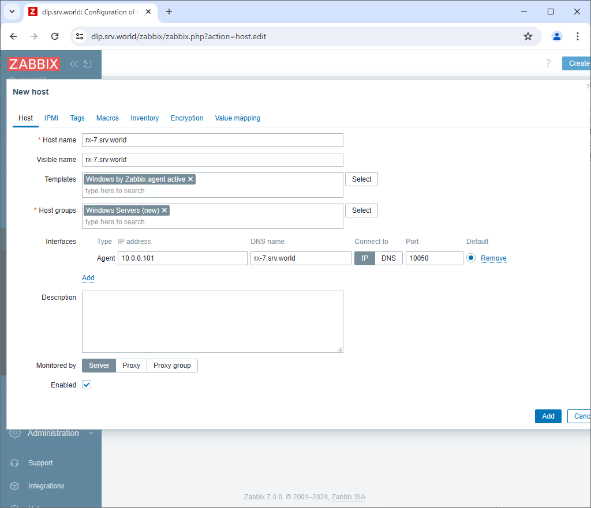
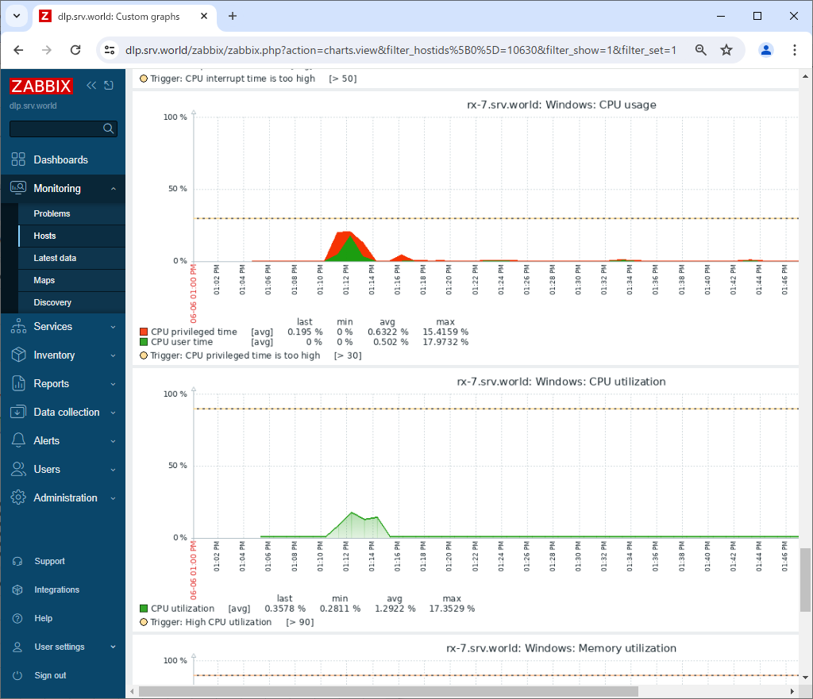

Zabbix 7.0 : Add Monitoring Target (Windows)
 	
Add Monitoring Target. Add a Windows Server 2022 Host as an example on here.

[1]	Download an Installer of Zabbix Agent on target Windows host from the Zabbix site below.
Generally, select [Windows (msi) amd64] to download.
On this example, it downloads and installs [Zabbix Agent 2] as with Linux Hosts.
When installing with MSI Installer, settings of Zabbix Agent is configured all like service or Firewall rule (allowed 10050 port).
⇒ https://www.zabbix.com/download_agents

[2]	After downloading, Click MSI Installer to install Zabbix Agent.
During installation, setting of Zabbix Server is required, input Hostname or IP address of your Zabbix Server like follows. For other settings, it's OK with default.
(possible to change all parameters later if need on [C:\Program Files\Zabbix Agent 2\zabbix_agentd2.conf].

 	After finishing Installation, Zabbix Agent will start like follows.

[3]	Login to Zabbix admin site with admin user and click [Data collection] - [Hosts] on the left pane, and then click [Create Host] button on the upper-right.

[4]	Input hostname for [Hostname] field and input any name for [Visible name] field. For [Templates] section, to click [Select] button, monitoring templates are shown, then select a template you'd like to apply to this Host. For general Windows OS, select [Windows by Zabbix agent active] like follows. For [Groups] section, select a group or add a new group you'd like to manage this Host. For [Interfaces] section, input IP address and DNS name of this Host. If that's OK, click [Add] button.

[5]	New monitoring target host is added. After few minutes, monitoring data are collected like follows.

 
 