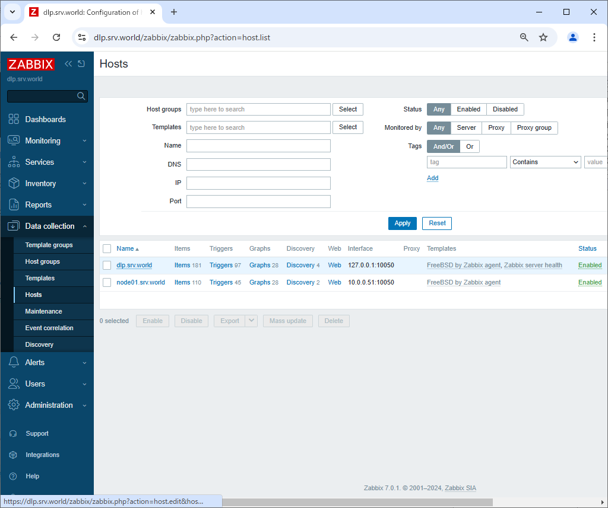

Zabbix 7.0 : Add Monitoring Target Item
 	
The templates are provided by default for well known services, so it's easy possible to monitor them.

For example, Add Apache httpd service on Zabbix server as a monitoring target item.

[1]	Enable server-status on Apache httpd.
```sh
root@belajarfreebsd:~# vi /usr/local/etc/apache24/Includes/server-status.conf
# create new
<Location /server-status>
    SetHandler server-status
    Require local
</Location>

root@belajarfreebsd:~# service apache24 reload
```
[2]	Login to Zabbix admin site with admin user and click [Data collection] - [Hosts] on the left pane, and then click the target Host you add a new item and select [Configuration].

[3]	Click [Select] button on [Templates] section.

[4]	Click [Select] button.

[5]	Click [Templates/Applications].

[6]	Select [Apache by HTTP].

[7]	Click the [Update] button to update the settings.

[8]	Click the [Apache by HTTP] link to open the settings.

[9]	Go to the [Macros] tab, enter 127.0.0.1 in {$APACHE.STATUS.HOST}, and click Update.

[10]	This completes the setup. After a certain period of time has passed, the data will start to be displayed.

