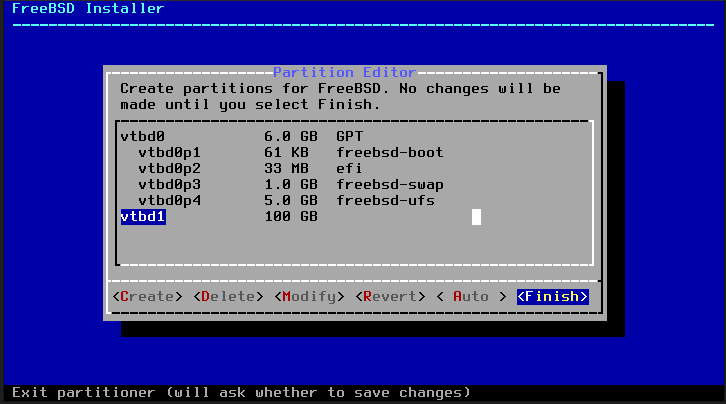

<p align="center">

</p>

### Catatan hasil belajar FreeBSD support versi =>11.*
## Cara 1 Menambah Disk ke 2 menggunakan bsdinstall/sade
```sh term
bsdinstall partedit
# atau 
sade
```


Untuk format disesuaikan dengan yang ada, misal dari gambar di atas menggunakan format GPT

Cek pembaruan pada file /etc/fstab
```sh term
cat /etc/fstab
```
gunakan perintah mkdir untuk membuat dir /data/:
```sh
mkdir /data/
```
jalan dengan perintah mount:
```sh
mount -a
```

Verifikasi dengan perintah df:
```sh
df
```
## Cara 2 Menambah Disk ke 2 menggunakan cli
Gunakan perintah untuk mencari disk baru :
```sh term
dmesg | grep -i disk

# atau:
grep -i disk /var/run/dmesg.boot
```
Terlihat, informasi yang terinstall pada Freebsd. Buat sebuah partisi disk baru terpasang. Schema sesuaikan dengan partisi sebalumnya:
```sh term
gpart create -s GPT da0
```
da0 created

lakukan verifikasi:
```sh term
gpart show da0
```
Sample outputs:

=>      40  10485680  da0  GPT  (5.0G)
        40  10485680       - free -  (5.0G)

Make sure the partition is aligned to one megabyte boundaries for performance reasons and add a new partition:
# gpart add -t freebsd-ufs -a 1M da0
da0p1 added

Verify it:
# gpart show da0

Sample outputs:

=>      40  10485680  da0  GPT  (5.0G)
        40      2008       - free -  (1.0M)
      2048  10481664    1  freebsd-ufs  (5.0G)
  10483712      2008       - free -  (1.0M)

Format /dev/da0p1 partition by typing the following command:k:
# newfs -U /dev/da0p1

Sample outputs:

/dev/da0p1: 5118.0MB (10481664 sectors) block size 32768, fragment size 4096
	using 9 cylinder groups of 626.09MB, 20035 blks, 80256 inodes.
	with soft updates
super-block backups (for fsck_ffs -b #) at:
 192, 1282432, 2564672, 3846912, 5129152, 6411392, 7693632, 8975872, 10258112

Finally create a new directory to mount file system:
# mkdir /data/
# mount /dev/da0p1 /data/
# df

Update the /etc/fstab:
# vi /etc/fstab

Append the following line:

/dev/da0p1	/data/		ufs	rw	2	2

Save and close the file. For info see the following man pages using the man command or help command:
$ man newfs
$ man gpart
$ man sade

[Sumber--> ](https://www.cyberciti.biz/faq/freebsd-adding-second-hard-disk-howto/)(https://www.cyberciti.biz/faq/freebsd-adding-second-hard-disk-howto/)
