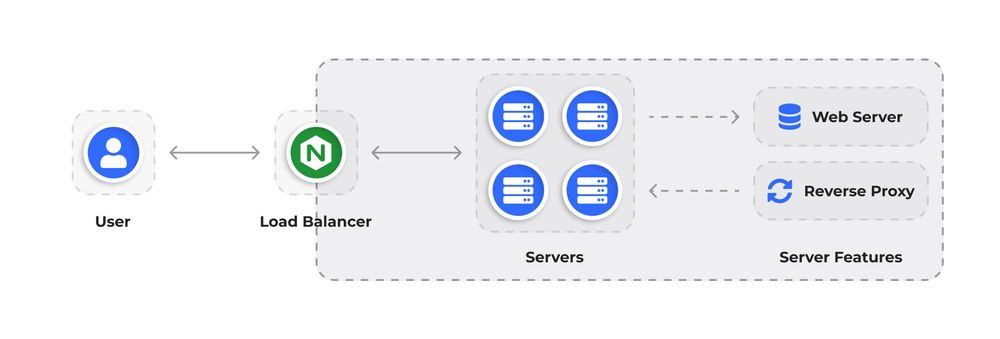

<br>
Nginx memiliki sejumlah fitur yang dapat digunakan untuk melindungi aset web Anda dari serangan DDoS.

1. Pembatasan kecepatan. Menurunkan beban server dan mencegah serangan DDoS volumetrik dari satu sumber.
```sh
limit_req_zone $binary_remote_addr zone=mylimit:10m rate=10r/s;

server {
   location /login/ {
       limit_req zone=mylimit;
       
       proxy_pass http://my_upstream;
   }
}
```
2. Penyeimbangan beban. Menyebarkan beban secara merata di antara beberapa server dan menurunkan risiko serta dampak server mogok saat terjadi serangan.
```sh
http {
   upstream myapp1 {
       server srv1.example.com;
       server srv2.example.com;
       server srv3.example.com;
   }

   server {
       listen 80;

       location / {
           proxy_pass http://myapp1;
       }
   }
}
```
3. Menolak koneksi. Mencegah serangan DDoS yang didasarkan pada pembuatan banyak koneksi ke server.
```sh
upstream api_service {
    server 127.0.0.1:9051;
    server 10.1.1.77:9052;
}

limit_conn_zone $binary_remote_addr zone=limitconnbyaddr:20m;
limit_conn_status 429;

server {
    listen 80;
    server_name testapp.tecmint.com;
    root /var/www/html/testapp.tecmint.com/build;
    index index.html;
    
    limit_conn   limitconnbyaddr  50;
    
    #include snippets/error_pages.conf;
    proxy_read_timeout 600;
    proxy_connect_timeout 600;
    proxy_send_timeout 600;
    location / {
        try_files $uri $uri/ /index.html =404 =403 =500;
    }
    
    location /api {
        proxy_pass http://api_service;
        proxy_set_header X-Real-IP $remote_addr;
        proxy_set_header Host $host;
        proxy_set_header X-Forwarded-For $proxy_add_x_forwarded_for;
        proxy_http_version 1.1;
        proxy_set_header Upgrade $http_upgrade;
        proxy_set_header Connection "upgrade";
    }
}
```
4. Menurunkan TTL. Memutus koneksi yang menganggur dan mencegah serangan DDoS yang didasarkan pada menjaga banyak koneksi tetap terbuka.
```sh
http {
    ...
    # Enabling Keep-Alive Connections
    keepalive_timeout 60s;

    # Caching
    proxy_cache_path /data/nginx/cache keys_zone=cache_zone:10m;
    map $request_method $purge_method {
        PURGE   1;
        default 0;
    }

    server {
        # Compression 
        gzip on;
        gzip_types text/plain application/xml;
        gzip_proxied no-cache no-store private expired auth;
        gzip_min_length 1000;

        location / {
            # Caching
            proxy_pass http://backend;
            proxy_cache cache_zone;
            proxy_cache_key $uri;
            proxy_cache_purge $purge_method;
        }
        ...
    }
}
```
5. Kontrol penyangga. Mencegah serangan DDoS volumetrik.
